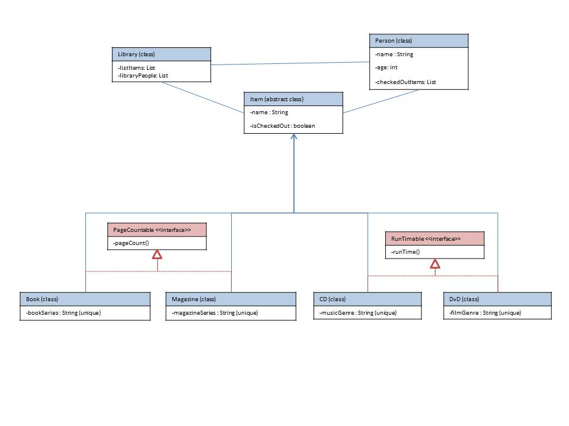

# Library 

Create a Library system with functionality to manage items inside the library and people who use the library (e.g. Library, Person, Item objects).
	
1. research UML and make a class diagram for your Library system.

2. it needs at least one abstract class (e.g. Item)
3. it needs at least one interface (e.g. Readable)
4. your library system should be able to manage at least three of the following items:	
	i. Books
	i. Maps
	i. Government docs
	i. Media resources (e.g Photos)
	i. Newspapers
	i. Journals
	i. Magazines
	i. Dissertations
5. each item should contain at least one unique attribute (e.g. a Book might have String bookSeries)
	your Library should contain the following methods:
6. let a Person check out an item
	i. let a Person return an item
	i. add an item to the library
	i. remove an item from the library
	i. update an item within the library
	i. register a Person
	i. delete a Person
	i. update a Person